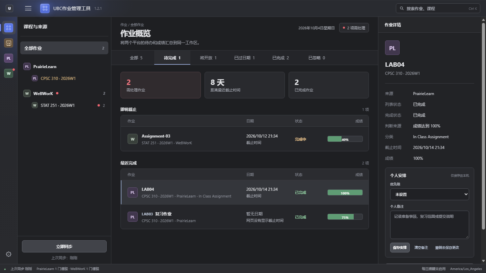
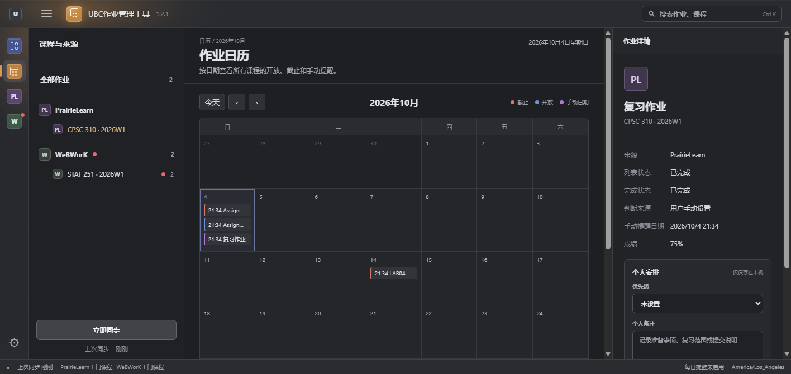

# UBC 作业管理工具

[English installation and first-use guide](README.en.md)

本地作业管理应用，将 PrairieLearn 和 UBC WeBWorK 的作业、开放时间与截止时间集中到一个界面，并提供系统通知、日历视图和微信每日汇总。Windows 版已稳定发布；macOS 桌面版正在预览验证。

当前稳定版本：**1.2.1** · [下载最新版](https://github.com/AnonChihaya0908/ubc-assignment-manager/releases/latest) · [提交问题](https://github.com/AnonChihaya0908/ubc-assignment-manager/issues)

macOS **1.3.1 预览版**：[下载 DMG 或 ZIP](https://github.com/AnonChihaya0908/ubc-assignment-manager/releases/tag/v1.3.1)。[Windows 1.3.0 预览版](https://github.com/AnonChihaya0908/ubc-assignment-manager/releases/tag/v1.3.0) 继续提供；Windows 1.2.1 仍是稳定版。macOS 版仍需在真实 Mac 上验证首次安装、通知和课程同步。应用内自动更新不会推送预览版。

> 本项目不是 UBC、PrairieLearn 或 WeBWorK 的官方产品。应用只读取用户登录后有权访问且页面上可见的数据，不使用教师 API，也不需要 PrairieLearn API token。



## 主要功能

| 功能 | 说明 |
| --- | --- |
| 多平台汇总 | 分开管理 PrairieLearn 与 UBC WeBWorK，支持按平台和课程查看作业。 |
| 作业状态 | 区分待完成、完成中、将开放、已过日期、已完成和已忽略；成绩以进度条显示。 |
| 作业日历 | 在月视图中查看开放日期、截止日期和手动提醒日期。 |
| 本地提醒 | 默认在截止前 24 小时和 3 小时发送系统通知，可调整提前时间和免打扰时段。 |
| 微信汇总 | 可通过 Server酱向个人微信发送每日待办汇总。 |
| 课程管理 | 可按课程忽略不计分的作业类别，并单独关闭某门课程的提醒。 |
| 个人安排 | 支持优先级、个人备注、手动提醒日期和手动完成状态。 |
| 后台运行 | 关闭主窗口后继续运行；Windows 用系统托盘，macOS 用菜单栏或 Dock 重新打开。 |
| 数据备份 | 可导出和恢复 JSON 备份；凭证、Cookie 与浏览器登录资料不会写入备份。 |
| 软件更新 | 启动时检查 GitHub Release；Windows 可自动安装并重启，macOS 下载对应架构的 DMG 或 ZIP 后手动替换 App。 |

## 下载与安装

### Windows 安装版（推荐）

1. 前往 [Releases](https://github.com/AnonChihaya0908/ubc-assignment-manager/releases/latest)。
2. 下载并运行 `ubc-assignment-manager-1.2.1-setup.exe`。
3. 从桌面或开始菜单打开“UBC作业管理工具”。

安装程序只为当前 Windows 账户安装应用。运行时无需打开 CMD，也无需另行安装 Node.js。

### Windows 便携版

下载 `ubc-assignment-manager-1.2.1-windows.zip` 并完整解压后运行。请勿只移动其中的 EXE，运行时还需要压缩包内的 `runtime` 等文件。Release 同时提供 `.zip.sha256` 校验文件。

### macOS 桌面版预览

macOS 版是独立 `.app`；1.3.1 同时提供 DMG（拖入“应用程序”）与 ZIP（解压后移入“应用程序”），原有 PKG 仍保留。从“应用程序”双击打开后，主界面显示在 App 自有窗口，Dock 与应用切换器可找到它；不需要打开普通浏览器标签页，也不用自行安装 Node.js。1.3.1 默认通过应用内置 WebKit 登录与同步，也可在设置中选择 Chrome 或 Edge；旧的 1.3.0 预览包仍需要 Edge。

目前 [macOS 1.3.1 预览安装包](https://github.com/AnonChihaya0908/ubc-assignment-manager/releases/tag/v1.3.1) 尚待真实 Mac 首次安装验证，**不是稳定版**。下载时按处理器选择 `macos-arm64.dmg` / `.zip`（Apple Silicon）或 `macos-x64.dmg` / `.zip`（Intel），并保留同名 `.sha256` 文件。详细步骤见 [macOS 安装与使用说明](docs/macos-preview.md)。现有 Windows 安装包和便携包继续保留。

### 系统要求

- Windows 10 或 Windows 11
- Microsoft Edge 或 Google Chrome（当前源码；已发布的 1.3.0 Windows 安装包仍需要 Edge）
- 系统自带的 .NET Framework

macOS 预览版需要 macOS 12 或更新版本与对应架构的安装包。1.3.1 使用内置 WebKit 登录与同步，尚待真实 Mac 验收；旧的 1.3.0 预览包仍需要 Edge。

应用在屏幕空间足够时以 1440 × 810 的 16:9 窗口打开；较小屏幕会按可用区域缩放。

## 快速开始

1. 首次启动时按引导粘贴课程网址：
   - PrairieLearn：`https://us.prairielearn.com/pl/course_instance/数字/assessments`
   - UBC WeBWorK：`https://webwork.elearning.ubc.ca/webwork2/课程名`
2. 打开“设置 → 课程与登录”，选择课程并点击“打开登录窗口”。
3. 在专用登录窗口中完成学校网站登录；返回应用后可以点击“隐藏登录窗口”。可在同页选择自动、Edge、Chrome，Mac 还可选择内置 WebKit。
4. 点击左下角“立即同步”。应用会在后台使用同一专用资料读取作业，后续定时同步也不会弹出课程窗口。若学校登录过期，请在课程设置中重新打开登录窗口。

专用登录窗口使用独立的本地浏览器资料，因此不会自动继承日常 Chrome、Edge 或 Safari 的登录状态。Chrome 和 Edge 切换可见登录与后台同步时会重启专用浏览器并保留其资料；Mac 内置 WebKit 则保留专用网页视图。请先完成学校验证码或双重验证，再隐藏窗口。不同浏览器的登录资料互不共享。新安装不会预置开发者或其他用户的课程；首次使用时还会要求确认本机课程，未确认的课程不会打开、同步或发送提醒。

Mac 内置 WebKit 使用与 Safari 相同的网页引擎，但不是 Safari 应用，也不会读取 Safari 的 Cookie。若学校登录流程拒绝内置网页视图，可在“设置 → 课程与登录”改用 Chrome 或 Edge；切换后需在新浏览器中重新登录。

如果 PrairieLearn 自动同步失败，可以在已登录的日常浏览器中复制作业表格，然后到“设置 → 课程与登录”使用手动导入。WeBWorK 需要通过专用登录窗口同步。

## 作业日历

点击最左侧的日历图标进入月视图。日历分别标出：

- **橙色**：截止时间
- **蓝色**：开放时间
- **紫色**：手动提醒日期

点击日历中的作业可以在右侧查看课程、状态、成绩和个人安排。



## 完成状态与课程类别

应用默认将网站成绩达到 `100%` 的作业标记为已完成。用户仍可手动改为未完成或已完成。开启“设置 → 常规与窗口 → 所有完成状态需要手动确认”后，达到 100% 的作业会留在待完成列表顶部，直到手动确认。

如果课程页面提供作业分组，“设置 → 课程与登录”会显示可管理类别。可以只在某一门课中忽略不计入成绩的类别。被忽略的作业会保留成绩、日期和个人设置，但不会进入待办计数、目录红点、系统通知或微信汇总，可随时在“已忽略”中恢复。

## 提醒与后台运行

应用运行期间会每 30 分钟尝试刷新已经登录的课程。Windows 版关闭主窗口后仍在系统托盘运行：

- 双击托盘图标：重新打开主窗口
- 托盘右键菜单：立即同步、暂停或恢复提醒、退出应用
- “设置 → 常规与窗口”：开启登录 Windows 后自动启动
- “设置 → 提醒与同步”：修改提醒时间、免打扰时段和逐门课程开关

只有从系统托盘或“设置 → 数据与退出”退出，后台才会停止。电脑关机或应用完全退出时无法发送提醒。

### 每日邮件提醒

在“设置 → 提醒与同步”中填写自己的 Gmail 地址和**应用专用密码**，再填写收件地址并发送测试邮件。确认收到后，开启每日邮件提醒并保存发送时间与范围。邮件包含尚需处理的课程、作业、截止时间及课程网页链接。邮件由本机经 Gmail 发送，无需另行部署服务器；应用不会要求 Gmail 主密码。

Gmail 应用专用密码通常要求账户开启两步验证，且学校或单位账户可能不允许创建。当前版本仅支持 Gmail 发件账户；Outlook 发件需要另行接入 OAuth 授权，因此目前不能连接 Outlook。具体限制及设置步骤见[邮件提醒说明](docs/email-reminders.md)。电脑关机、睡眠或应用退出时无法按时发送；当天重新运行后会补发一次，发送失败最多重试三次。

macOS 预览版关闭窗口后仍由 App 自身运行，菜单栏图标或 Dock 可重新打开。可在“设置 → 提醒与同步”允许 macOS 系统通知并发送测试通知；完全退出 App 或关机后无法实时发送本地通知。macOS 的菜单栏图标可在设置中隐藏，应用菜单仍可退出。

### 个人微信每日汇总

1. 在 [Server酱 Turbo](https://sct.ftqq.com/docs/getting-started/sendkey/) 获取并绑定个人微信的 `SCT` SendKey。
2. 打开“设置 → 提醒与同步”，填写 SendKey，选择每天的电脑当地时间并保存。
3. 点击“发送测试消息”，在微信中确认实际收到消息。

应用每天最多发送一条成功的自动汇总。如果设定时间电脑未开机，当天稍后启动会补发当天汇总；如果次日才启动，不会逐日补发关机期间的旧消息。发送失败最多重试两次，每次至少间隔 30 分钟。

作业名称、课程名称和日期会发送给 Server酱。SendKey 只保存在当前设备账户的本地数据目录中，不会显示在应用状态接口或备份中。未启用微信提醒时，应用不会把作业清单发送给 Server酱。

## 软件更新

应用启动时通过 GitHub 公共 HTTPS API 检查最新稳定版，无需 GitHub CLI、GitHub 登录或 token。发现新版本后可以选择“稍后”或“立即更新并重启”。

立即更新会下载对应的 Windows 便携包及 SHA-256 文件，验证后备份程序文件、安装新版并重新打开。新版无法启动时会恢复旧版。课程、完成状态、提醒设置和专用 Edge 登录资料保存在独立数据目录中，不参与程序文件替换。

应用内安装只在安装版或独立解压的便携版中启用。在包含 `.git` 的开发目录中运行时不会覆盖源码。

macOS 预览版同样可在应用内检查更新；正式稳定版提供两种下载入口。预览版可从对应的 GitHub Release 手动下载 DMG 或 ZIP，退出旧版后替换 `.app`。课程、作业和提醒设置独立存放，不会因替换 App 而删除。

## 数据与隐私

用户数据保存在 `%LOCALAPPDATA%\UBC作业管理工具\data`，其中可能包含课程清单、作业数据、SendKey、加密的邮件授权和专用 Edge 登录资料。不要公开或提交这个目录。

macOS 预览版将这些数据保存在当前账户的 `~/Library/Application Support/UBC作业管理工具/data`，不会打入安装包。

“设置 → 数据与退出”可以导出 JSON 备份。备份包含课程、缓存作业、手动完成状态、提醒日期、优先级、备注、忽略类别和普通设置；以下内容不会导出：

- Server酱 SendKey
- 邮件发件授权
- Cookie 和 Edge 登录资料
- 消息发送记录
- 课程与作业网址中的个人查询参数

恢复备份会替换当前课程和作业，应用会先在本机创建恢复点。恢复后需要重新登录课程，并重新配置微信和邮件发件凭证。

## 已知限制

- 列表只包含登录后当前页面可见的作业。网站结构变化时同步可能失败；失败不会清空上次的本地数据。
- PrairieLearn 页面日期可能不显示年份，应用会按课程学期推算，并按电脑当地时间解释。请核对个人延期、改期和时区。
- PrairieLearn 的 `100% until` 通常表示按时得分阶段结束。其他百分比的 `until` 可能是早鸟或迟交阶段，应用不会自动将其作为截止提醒。
- WeBWorK 开放中作业只有出现 `Due` 才会设置截止提醒；`Will open on` 只作为开放时间。明确标注的 PDT/PST 会按其时区换算。
- 系统通知和微信汇总依赖本机后台运行，不是云端服务。macOS 预览版尚待真实设备完成安装、通知和 Edge 同步验收。

## 开发

开发环境需要 Node.js 22 或更高版本。项目不依赖第三方 npm 包。

```powershell
npm test
npm run test:browser
npm run build:app
node app.js --no-open
```

`npm run build:app` 会生成安装包、便携包和 SHA-256 校验文件。发布包不应包含开发者课程数据、Edge 登录资料或 SendKey。

macOS 构建在对应架构的 Mac 上运行 `bash macos/build-release.sh arm64 输出目录` 或 `bash macos/build-release.sh x64 输出目录`。脚本固定校验官方 Node.js 运行时，并从同一个 `.app` 生成未签名、未公证的 DMG、ZIP、PKG 和各自的 SHA-256 文件。

## 反馈

发现同步错误、界面问题或希望增加功能时，请在 [GitHub Issues](https://github.com/AnonChihaya0908/ubc-assignment-manager/issues) 提交问题，并注明应用版本、平台和可复现步骤。请勿上传 SendKey、Cookie、课程账户信息或 `%LOCALAPPDATA%\UBC作业管理工具\data` 中的文件。
